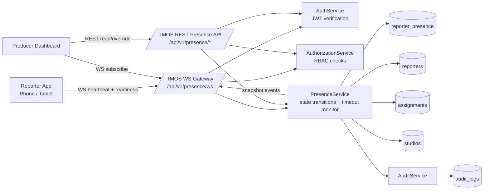

# Phase 3.2 Architecture - Reporter Presence Foundation

## Notes

- Backend remains the system of record and sole gateway for all presence operations.
- WebSocket and REST layers share the same PresenceService, RBAC, and audit paths.
- No media transport is present in Phase 3.2 (no WebRTC, no LiveKit, no streaming).
- This phase establishes readiness telemetry and connection observability ahead of media integration.
