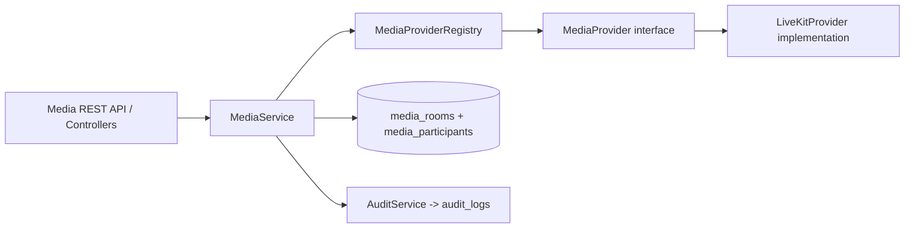

# Phase 3.3 Step 1 - Media Abstraction Layer

Date: 2026-07-17
Status: Complete

## Objective

Establish a provider-agnostic media foundation before implementing live video UI/media workflows.

## Architecture

The TMOS application now calls media operations only through a generic provider interface.

Key rule:
- Routes, controllers, and service orchestration use only abstraction-layer contracts.
- Vendor-specific logic is contained in provider implementation classes only.

## Added Components

Backend media abstraction:
- `backend/src/media/MediaProvider.js`
- `backend/src/media/MediaProviderRegistry.js`
- `backend/src/media/buildMediaProviderRegistry.js`
- `backend/src/media/providers/LiveKitProvider.js`

Persistence:
- `backend/src/db/migrations/005_media_abstraction.sql`
- `backend/src/repositories/MediaRepository.js`

Service/controller/routes:
- `backend/src/services/mediaService.js`
- `backend/src/controllers/MediaController.js`
- media routes in `backend/src/routes/v1.js`

Bootstrap wiring:
- media registry/service wiring in `backend/src/server.js`
- app composition update in `backend/src/app.js`

## Generic Concepts Implemented

- Media Sessions
- Rooms
- Participants
- Publishers
- Subscribers
- Device Selection
- Join/Leave
- Producer Controls

## RBAC + Audit

Permissions added:
- `media.capabilities.read`
- `media.rooms.read`
- `media.rooms.write`
- `media.session.join`
- `media.session.leave`
- `media.device.select`
- `media.publisher.control`
- `media.producer.control`

Audit actions:
- `media.session.create`
- `media.session.join`
- `media.session.leave`
- `media.provider.selected`
- `media.device.select`
- `media.publisher.toggle`
- `media.producer.control`

## API Contracts

- `GET /api/v1/media/providers/capabilities`
- `GET /api/v1/media/rooms`
- `POST /api/v1/media/rooms`
- `POST /api/v1/media/sessions/join`
- `POST /api/v1/media/sessions/:participantId/leave`
- `POST /api/v1/media/sessions/:participantId/devices`
- `POST /api/v1/media/sessions/:participantId/publisher`
- `POST /api/v1/media/sessions/:participantId/producer-control`

## Testing

Added tests:
- `backend/src/media/providers/LiveKitProvider.test.js`
- `backend/src/services/mediaService.test.js`
- `backend/src/routes/media.integration.test.js`
- media permission coverage in `backend/src/auth/routeAuthorization.test.js`

## Explicit Non-Goals in Step 1

Not implemented:
- Reporter camera preview UI
- Microphone preview UI
- Live room visual dashboard
- Active media rendering
- Streaming UX

This step is architecture-first and implementation-ready for Step 2/3 media features.
