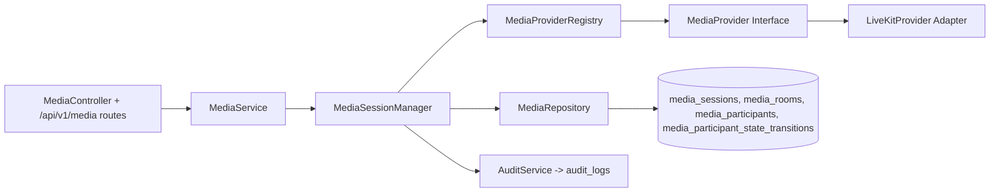
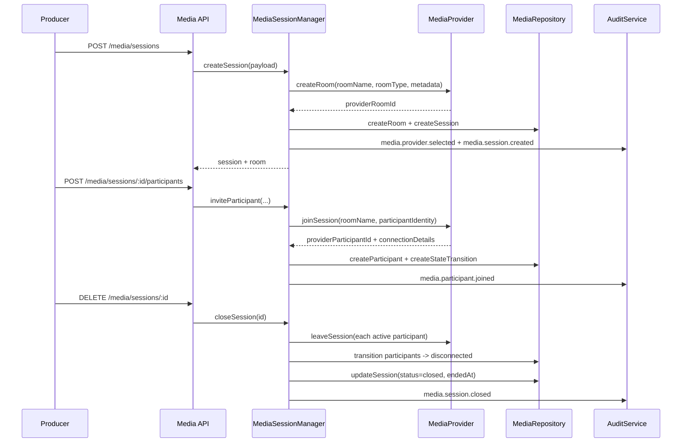

# Phase 3.3 Step 2 Architecture - Media Session Orchestration

Date: 2026-07-17
Status: Implemented

## Objective

Establish TMOS as the source-of-truth control plane for live media sessions and participant lifecycle while preserving provider abstraction boundaries.

## Provider-Agnostic Architecture

Boundary rule:
- Controllers, routes, services, and orchestration logic never import provider-specific adapters directly.
- Only registry builder and provider adapter layers reference `LiveKitProvider`.

## Session Orchestration Responsibilities

`MediaSessionManager` is the centralized orchestrator for:
- Session creation
- Session metadata updates
- Session closure/termination
- Participant invite/remove
- Producer control operations (mute/unmute/promote/demote/transfer)
- Participant lifecycle validation and state transition recording

## Session Lifecycle Sequence

## Participant Lifecycle State Machine

States:
- offline
- authenticated
- connected
- joined
- ready
- live
- muted
- disconnected

Validation:
- Transitions are explicitly validated.
- Invalid transitions are rejected with `VALIDATION_ERROR`.
- Valid transitions are persisted in `media_participant_state_transitions` and audited.

## Persistence Additions

Migration:
- `backend/src/db/migrations/006_media_session_orchestration.sql`

New/updated persistence entities:
- `media_sessions`
- `media_participant_state_transitions`
- Extended `media_participants` with `session_id`, `lifecycle_state`, producer flags, invitation and promotion metadata.

## API Surface (Step 2)

Session endpoints:
- `POST /api/v1/media/sessions`
- `GET /api/v1/media/sessions`
- `GET /api/v1/media/sessions/:id`
- `PATCH /api/v1/media/sessions/:id`
- `DELETE /api/v1/media/sessions/:id`

Participant endpoints:
- `POST /api/v1/media/sessions/:id/participants`
- `DELETE /api/v1/media/sessions/:id/participants/:participantId`
- `POST /api/v1/media/sessions/:id/mute`
- `POST /api/v1/media/sessions/:id/unmute`
- `POST /api/v1/media/sessions/:id/promote`
- `POST /api/v1/media/sessions/:id/demote`
- `POST /api/v1/media/sessions/:id/transfer`

## Security and Governance

RBAC additions:
- `media.session.read`
- `media.session.create`
- `media.session.update`
- `media.session.close`
- `media.participant.manage`
- `media.producer.transfer`

Fail-closed checks:
- Route authorization mapping includes every protected Step 2 endpoint and is validated by startup/test guard (`assertNoUnmappedProtectedV1Routes`).

Audit actions added:
- `media.session.created`
- `media.session.updated`
- `media.session.closed`
- `media.participant.joined`
- `media.participant.left`
- `media.participant.muted`
- `media.participant.unmuted`
- `media.participant.promoted`
- `media.participant.demoted`
- `media.producer.transferred`
