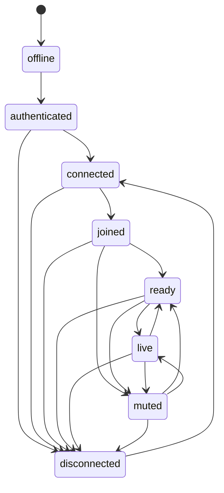

# Phase 3.3 Step 2 - Participant State Machine

Date: 2026-07-17
Status: Active

## Purpose

Define and enforce a formal participant lifecycle for provider-agnostic media session orchestration.

## States

- `offline`
- `authenticated`
- `connected`
- `joined`
- `ready`
- `live`
- `muted`
- `disconnected`

## Allowed Transitions

- `offline` -> `authenticated`
- `authenticated` -> `connected`, `disconnected`
- `connected` -> `joined`, `disconnected`
- `joined` -> `ready`, `muted`, `disconnected`
- `ready` -> `live`, `muted`, `disconnected`
- `live` -> `ready`, `muted`, `disconnected`
- `muted` -> `ready`, `live`, `disconnected`
- `disconnected` -> `connected`

## Diagram

## Validation Rules

- Every transition is validated before persistence.
- Invalid transitions return `VALIDATION_ERROR` and are rejected.
- Transition records are persisted in `media_participant_state_transitions`.
- Transition outcomes are audited with correlation IDs.

## Audit Mapping

- `joined` -> `media.participant.joined`
- `disconnected` -> `media.participant.left`
- `muted` -> `media.participant.muted`
- `ready/live` -> lifecycle transition audit entries plus operation-specific events where applicable.

## Enforcement Location

State machine enforcement is centralized in:
- `backend/src/services/mediaSessionManager.js`

No route/controller/provider adapter performs independent transition logic.
