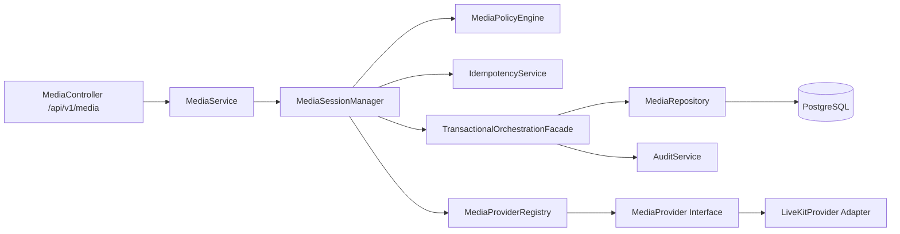
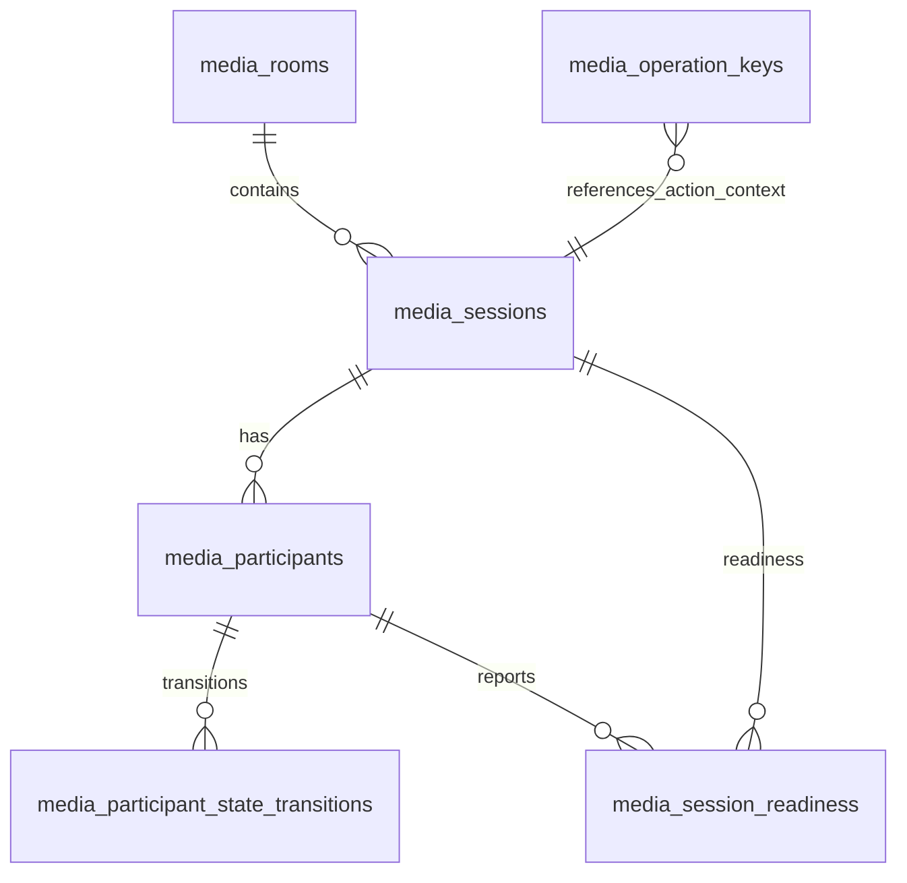
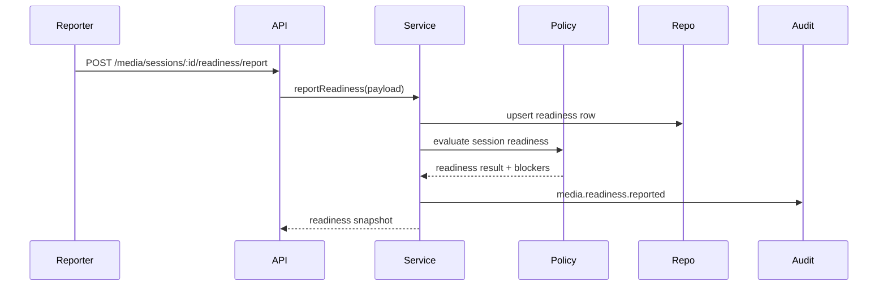
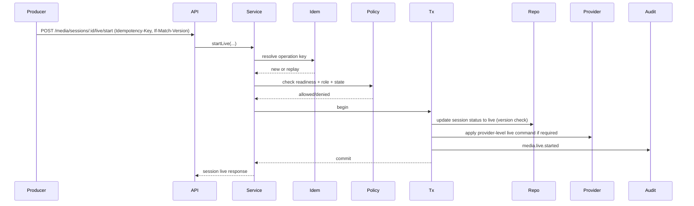
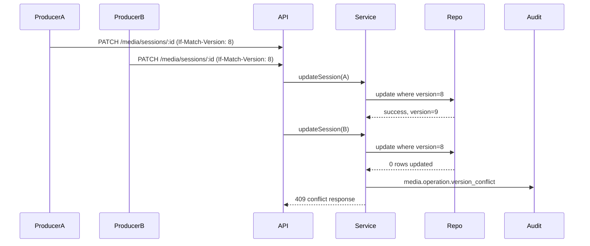
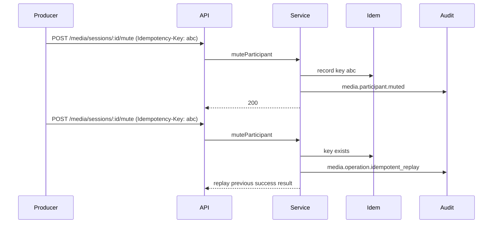

# Phase 3.3 Step 3 Architecture Design Document

Date: 2026-07-17
Status: Approved Design (Milestone 3 Implementation In Progress)
Author: TMOS Architecture Planning

## 1. Executive Summary

### Purpose of Step 3

Phase 3.3 Step 3 defines the reliability and operational control layer for live media operations on top of Step 2 orchestration. It focuses on deterministic session control, readiness gating, concurrency safety, idempotent producer operations, and audit integrity without breaking provider abstraction boundaries.

### Business Objectives

- Reduce live broadcast operational risk before on-air transition.
- Prevent inconsistent control-room actions during concurrent producer operations.
- Improve audit trustworthiness and traceability for compliance.
- Enable controlled scale-out for larger sessions and higher participant counts.

### Technical Objectives

- Preserve strict provider-agnostic architecture through `MediaProvider`.
- Add transaction-safe orchestration patterns for multi-step operations.
- Introduce readiness and go-live gating logic as TMOS control-plane policy.
- Add idempotency and optimistic concurrency protections.
- Improve session query performance and pagination strategy.

## 2. Scope Definition

### In Scope

- Backend orchestration hardening for media session lifecycle.
- Readiness model and policy-based live transition controls.
- Transactional orchestration paths for state + audit consistency.
- Idempotent producer controls and conflict-safe operations.
- Additional RBAC permissions and fail-closed route mapping updates.
- New/updated audit events for readiness and live transitions.
- API contract expansion for readiness/live control workflows.
- Database migration for constraints, versioning, and new readiness entities.
- Testing and runtime validation design.

### Out of Scope

- Camera preview UI.
- Microphone preview UI.
- Live video rendering.
- Screen sharing.
- Recording implementation (recording flag remains control-plane metadata only).
- Teleprompter, IFB, PTZ, graphics overlays.
- Vendor SDK usage outside adapter layers.
- Frontend redesign.

### Dependencies on Phase 3.3 Step 2

Step 3 depends on:
- `MediaSessionManager` orchestration baseline.
- Session + participant persistence (`media_sessions`, `media_participants`, `media_participant_state_transitions`).
- Existing provider abstraction path (`MediaService` -> `MediaProviderRegistry` -> `MediaProvider`).
- Existing RBAC/audit framework and fail-closed route mapping gate.

## 3. System Architecture

### Architectural Fit

Step 3 adds policy and reliability components while preserving Step 2 layering.

### Service Interactions

- `MediaService`: API-facing orchestration facade, delegates to manager.
- `MediaSessionManager`: coordinates session/participant lifecycle policies.
- `MediaPolicyEngine` (new): validates readiness thresholds, live start/stop policy, role transfer guardrails.
- `IdempotencyService` (new): deduplicates replayed write actions using operation keys.
- `TransactionalOrchestrationFacade` (new): enforces atomic DB writes + audit records for critical operations.
- `MediaProvider` adapter path: provider operations only, no business policy logic.

### Data Flow

1. Request authenticated and permission-evaluated.
2. Idempotency key resolved (if write endpoint).
3. Policy checks performed (readiness, role ownership, transition validity).
4. Transactional write block executes state mutation + transition append + audit emit.
5. Provider call performed at policy-defined sequence point (pre/post state update depending on operation semantics).
6. Response returned in TMOS envelope with correlation ID.

### Integration with Existing MediaProvider Abstraction

Preserved mandatory path:
- Controller -> MediaService -> MediaSessionManager -> MediaProviderRegistry -> MediaProvider -> Adapter.

Prohibited in Step 3:
- Direct adapter import from controllers/services/routes/policy/repository.
- Provider-specific payload fields in API contracts.

## 4. Data Model

### Proposed Database Changes (Migration 007)

#### A. Integrity and Concurrency Hardening

- Add `version` INTEGER NOT NULL DEFAULT 0 to:
  - `media_sessions`
  - `media_participants`
- Update repository writes to use optimistic concurrency:
  - `WHERE id = $id AND version = $expectedVersion`
  - Increment `version = version + 1` on success.

#### B. Producer Ownership Integrity

- Add partial unique index for active producer per session:
  - unique on (`session_id`) where `is_producer = true` and `lifecycle_state <> 'disconnected'`.

#### C. Status/Lifecycle Constraints

- Add CHECK constraints:
  - `media_sessions.status IN ('active','paused','live','closed')`
  - `media_participants.lifecycle_state IN ('offline','authenticated','connected','joined','ready','live','muted','disconnected')`
  - `ended_at IS NULL OR ended_at >= started_at`

#### D. Readiness Data

New table: `media_session_readiness`
- `id` (pk)
- `session_id` (fk -> media_sessions)
- `participant_id` (fk -> media_participants)
- `camera_ready` BOOLEAN
- `microphone_ready` BOOLEAN
- `speaker_ready` BOOLEAN
- `network_quality` TEXT
- `last_reported_at` TIMESTAMPTZ
- `metadata` JSONB
- Unique (`session_id`, `participant_id`)

#### E. Idempotency Store

New table: `media_operation_keys`
- `id` (pk)
- `operation_key` TEXT UNIQUE
- `endpoint` TEXT
- `actor` TEXT
- `correlation_id` TEXT
- `response_hash` TEXT
- `created_at` TIMESTAMPTZ
- `expires_at` TIMESTAMPTZ

#### F. Zero-Downtime Migration Order

Migration `007_media_reliability_controls.sql` should execute in this order to preserve compatibility:
1. Add nullable/new columns and new tables first.
2. Backfill `version` values and readiness defaults.
3. Add new indexes.
4. Add CHECK constraints and partial uniqueness constraints last.
5. Deploy repository logic that writes/reads new fields after schema is present.

### Relationships

### Migration Strategy

- Create additive migration `007_media_reliability_controls.sql`.
- Backfill default `version = 0` values.
- Add constraints after data normalization checks.
- Create readiness and idempotency tables with non-blocking indexes where possible.

### Backward Compatibility

- Existing Step 1 and Step 2 endpoints remain unchanged.
- New constraints chosen to align with existing valid state values.
- New Step 3 endpoints additive; no required frontend change for existing workflows.

## 5. API Design

### New REST Endpoints (Step 3)

Readiness and live policy:
- `POST /api/v1/media/sessions/:id/readiness/report`
- `GET /api/v1/media/sessions/:id/readiness`
- `POST /api/v1/media/sessions/:id/live/start`
- `POST /api/v1/media/sessions/:id/live/stop`

Concurrency/idempotency support:
- Write endpoints accept `Idempotency-Key` header.
- Mutating requests support `If-Match-Version` header for optimistic concurrency.

### Request/Response Contracts (High-Level)

#### POST /media/sessions/:id/readiness/report
Request:
- participantId (required)
- cameraReady, microphoneReady, speakerReady (required booleans)
- networkQuality (enum: poor|fair|good|excellent)
- metadata (optional object)

Response:
- readiness snapshot for participant + session aggregate readiness.

#### GET /media/sessions/:id/readiness
Response:
- session readiness summary:
  - requiredParticipants
  - readyParticipants
  - blockers[]
  - canGoLive (boolean)

#### POST /media/sessions/:id/live/start
Request:
- `If-Match-Version` header (required)
- reason (optional)

Response:
- updated session status (`live`)
- transition timestamp

#### POST /media/sessions/:id/live/stop
Request:
- `If-Match-Version` header (required)
- reason (optional)

Response:
- updated session status (`active` or `paused` per policy)
- transition timestamp

### Authentication Requirements

- JWT auth required for all Step 3 endpoints.
- Auth middleware unchanged.

### RBAC Permissions (New)

- `media.readiness.report`
- `media.readiness.read`
- `media.live.start`
- `media.live.stop`
- `media.session.versioned.write`

Fail-closed requirement:
- Every Step 3 protected endpoint must map explicitly in `routeAuthorization.js`.
- Startup guard `assertNoUnmappedProtectedV1Routes()` must remain blocking for unmapped protected routes.

Role direction (proposed):
- Administrator: all
- Operator: all except producer transfer override unless explicitly granted
- Producer: readiness report/read + live start/stop + managed participant controls
- Viewer: readiness read only

### Audit Events (Step 3 Additions)

- `media.readiness.reported`
- `media.readiness.blocked`
- `media.live.started`
- `media.live.start_denied`
- `media.live.stopped`
- `media.operation.idempotent_replay`
- `media.operation.version_conflict`

All must include:
- `correlationId`
- actor
- target (session/participant)
- provider (`tmos` or provider key where relevant)
- metadata with policy decision context

Audit normalization rule for Step 3:
- Emit exactly one operation-level event for each producer action.
- Emit state-transition event only when transition evidence is not already represented by operation-level event metadata.

## 6. Sequence Diagrams

### A. Readiness Report

### B. Go Live Start

### C. Version Conflict on Concurrent Write

### D. Idempotent Replay

## 7. Security Review

### Authentication

- Continue JWT-based authentication through existing middleware.
- Require valid auth for all new endpoints.

### Authorization

- Add explicit Step 3 permission keys.
- Preserve fail-closed route mapping startup assertion.
- Reject missing mapping at boot.

### Input Validation

- Strong schema validation for readiness and live-transition payloads.
- Enum checks for readiness fields and network quality.
- Strict UUID/text format validation for IDs.

### Abuse Prevention

- Idempotency keys on mutating endpoints to mitigate retries/replay storms.
- Idempotency keys must be high-entropy (UUIDv4 or equivalent) and TTL-bounded.
- Reuse of an idempotency key with a different payload must return conflict.
- Per-session rate limiting for control actions (mute/unmute/promote/transfer/live start/stop).
- Correlation-id required for all writes in controller middleware path.

### Operational Security Considerations

- No provider credentials in responses.
- Avoid provider token leakage in audit metadata.
- Record denied live-start attempts for operational forensics.

## 8. Performance and Scalability

### Expected Workloads

- Typical: 1-5 active sessions, 5-20 participants per session.
- Burst events: rapid producer control operations, reconnect storms.
- Future scale target: 20-50 sessions, 1000+ transition events/hour.

### Potential Bottlenecks

- N+1 session list hydration.
- Sequential participant iteration during close/live transitions.
- Audit write amplification under high-frequency control operations.

### Optimization Strategies

- Add paginated `GET /media/sessions` with optional `includeParticipants=false`.
- Use aggregated query for active participant counts.
- Batch provider operations where semantically safe.
- Add async audit/event buffering option behind feature flag if required.
- Index tuning for readiness and operation-key lookups.

## 9. Testing Strategy

### Unit Tests

- Policy engine decisions:
  - readiness satisfied/blocked
  - live start allowed/denied paths
- Idempotency service behaviors:
  - first execution
  - replay
  - expired key
- Version conflict handler logic.

### Integration Tests

- Endpoint-level RBAC allow/deny for new permissions.
- Fail-closed route authorization mapping includes all Step 3 routes.
- Version mismatch returns 409 with normalized error envelope.
- Idempotency replay returns deterministic result.

### Runtime Validation

- Live smoke plan with correlation-scoped evidence:
  - readiness report -> live start -> control ops -> live stop
- DB verification of:
  - readiness rows
  - version increments
  - operation-key records
  - audit trail completeness

### Acceptance Criteria

- All backend tests pass.
- New Step 3 tests pass.
- Runtime validation report generated with audit evidence.
- No direct provider-adapter imports in routes/controllers/services/policy layer.
- Startup fail-closed authorization check passes.
- Backward compatibility verified for all existing Step 1/2 media endpoints and permission mappings.

## 10. Risk Assessment

### Technical Risks

- Incomplete transaction boundaries may still allow partial state under faults.
- Versioning conflicts can increase if client retry behavior is naive.

Mitigations:
- Transaction wrapper for critical multi-write operations.
- Clear 409 retry guidance and deterministic conflict payloads.

### Architectural Risks

- Step 3 policy complexity can bloat `MediaSessionManager`.

Mitigations:
- Extract policy engine and idempotency service into focused modules.
- Keep provider calls isolated behind interface.

### Operational Risks

- High-frequency control operations may generate noisy audit streams.

Mitigations:
- Define audit granularity policy and retention/archival strategy.
- Add dashboard summaries for conflict/replay/denied-live metrics.

### Recommended Mitigations Summary

1. Implement optimistic concurrency in session and participant writes.
2. Add idempotency for mutating control-plane endpoints.
3. Add DB constraints for state validity and producer uniqueness.
4. Add policy-engine-based live gating before live transition.
5. Add pagination and query optimization before higher-scale rollout.

## Design Approval Gate

Implementation must not begin until this Step 3 design is reviewed and approved.

Approval checklist:
- Provider-agnostic boundary preserved.
- RBAC + fail-closed mapping plan approved.
- Audit contract approved.
- Migration strategy approved.
- Test and runtime validation strategy approved.

## Implementation Progress Snapshot (Milestone 3)

Implemented to date:
- `TransactionalOrchestrationFacade` introduced for atomic state-plus-audit persistence when DB transactions are available.
- Transactional critical sections expanded across state-changing operations in `MediaSessionManager`.
- Readiness and live controls implemented with `MediaPolicyEngine` and `IdempotencyService`.
- Audit normalization events added for idempotent replay and version conflict.

Implemented endpoint contracts (authoritative):
- POST `/api/v1/media/sessions/:id/readiness`
- GET `/api/v1/media/sessions/:id/readiness`
- POST `/api/v1/media/sessions/:id/go-live`
- POST `/api/v1/media/sessions/:id/stop-live`

Concurrency and idempotency contract implemented:
- `If-Match-Version` optimistic concurrency support in mutating session operations.
- `Idempotency-Key` replay/conflict handling for go-live and stop-live.

Provider boundary confirmation:
- Provider calls continue through `MediaProviderRegistry`/`MediaProvider` only.
- Provider interaction remains outside transaction blocks; DB state and audit writes execute atomically.
