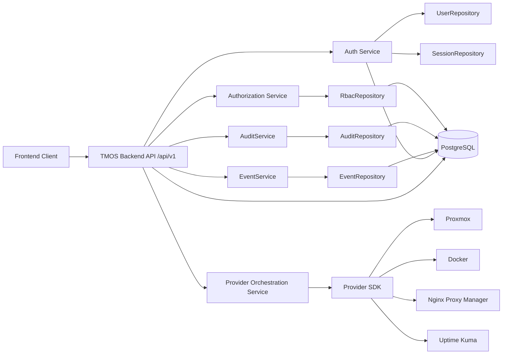
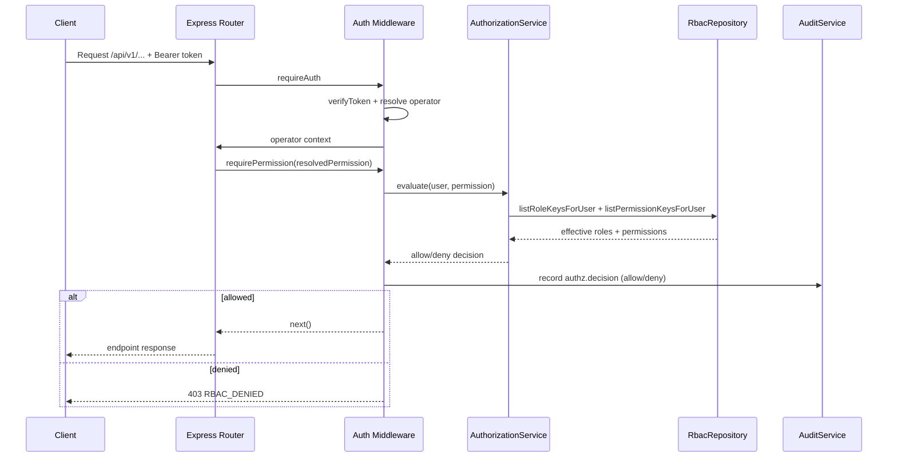

# TMOS v0.2 Architecture

Status: Released
Version: 0.2.0
Date: 2026-07-17

## 1. Scope

Version 0.2 finalizes RBAC as a backend-enforced, centralized, deterministic authorization model.

In scope:
- Authentication (JWT + session persistence)
- RBAC role/permission model
- Centralized authorization middleware
- Authorization decision auditing
- Protected-route mapping integrity checks at startup

Out of scope:
- Reporter Control Room
- UI role management workflows
- New provider integrations

## 2. High-Level Architecture

## 3. Runtime Authorization Flow

## 4. Core Components

- `backend/src/auth/permissionCatalog.js`
  - Canonical role and permission catalog.
- `backend/src/auth/routeAuthorization.js`
  - Route -> permission resolver.
  - Protected route extraction and unmapped-route detection.
- `backend/src/middleware/auth.js`
  - `requireAuth` and `requirePermission` middleware.
  - Authorization decision audit logging.
- `backend/src/services/authorizationService.js`
  - Deterministic allow/deny evaluation.
- `backend/src/repositories/RbacRepository.js`
  - Role/permission/user-role persistence operations.
- `backend/src/server.js`
  - RBAC catalog synchronization on startup.
  - Startup hard-fail on unmapped protected routes.

## 5. Security and Determinism Guarantees

- Backend-only enforcement for all protected API paths.
- Deny-by-default for unmapped protected routes.
- Startup fails if protected routes are missing explicit permission mapping.
- Allow/deny decisions are audited with correlation ID.
- Role and permission state is persisted in PostgreSQL.

## 6. Data Layer Freeze Note

Phase 1 data-layer baseline remains frozen except critical fixes needed to support RBAC correctness and security:
- `002_user_roles.sql` for role assignment persistence.
- No unrelated schema expansion in v0.2.
