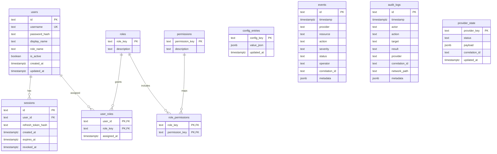

# TMOS v0.2 ER Diagram

Status: Released
Version: 0.2.0
Date: 2026-07-17

## ER Model (Phase 1 + RBAC)

## Notes

- `users.role_name` is retained for compatibility.
- Effective authorization is resolved from RBAC tables (`user_roles`, `role_permissions`, `permissions`, `roles`).
- `audit_logs` captures `authz.decision` events with permission context.
